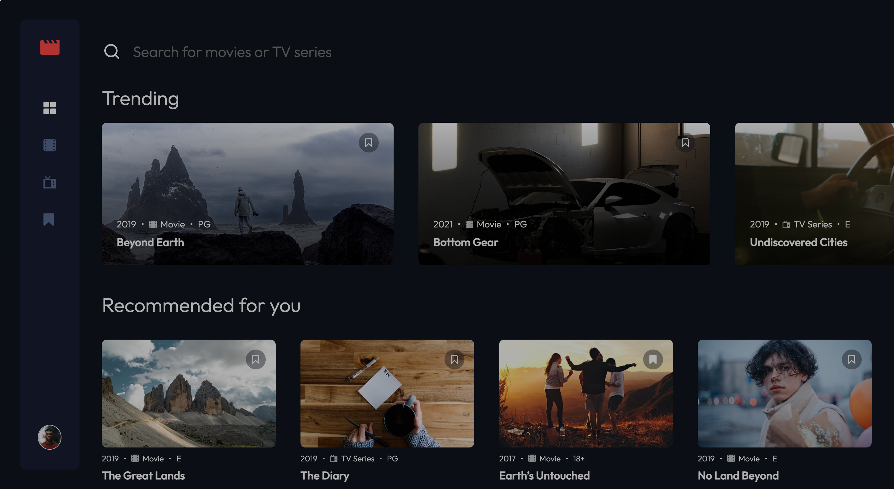

# Frontend Mentor - Entertainment web app solution

This is a solution to the [Entertainment web app challenge on Frontend Mentor](https://www.frontendmentor.io/challenges/entertainment-web-app-J-UhgAW1X). Frontend Mentor challenges help you improve your coding skills by building realistic project.

## 目次

- [概要](#概要)
  - [チャレンジ](#チャレンジ)
  - [スクリーンショット](#スクリーンショット)
  - [リンク](#リンク)
- [プロセス](#プロセス)
  - [使用したスキル](#使用したスキル)
  - [学んだこと](#学んだこと)

## 概要

### チャレンジ

ユーザーができること:

- 画面のサイズによって最適なレイアウトが表示される
- ページ上の全てのインタラクティブな要素でホバーした状態を見ることができる
- Home, Movies, TV Series, and Bookmarked Shows ページに移動できる
- 全ての映画、TV シリーズでブックマークの追加と削除ができる
- すべてのページで関連番組を検索することができる
- **Bonus**: Build this project as a full-stack application
- **Bonus**: If you're building a full-stack app, we provide authentication screen (sign-up/login) designs if you'd like to create an auth flow

### スクリーンショット

### リンク

- Live Site URL: [リンク](https://entertaiment-web-app.netlify.app/)

## プロセス

### 使用したスキル

- [React](https://reactjs.org/) - JS library
- Sass
- Flexbox
- CSS Grid
- Mobile-first workflow

### 学んだこと

- React Router の使い方について学ぶことができた。私が React Router について学んでいた時バージョンが 5 であり、現在は 6 がリリースされていたので、6 での書き方に苦戦した。だがなんとか実装することができた。

### 改善点

- それぞれのページで映画や TV シリーズのブックマークアイコンをクリックするとアイコンの表示が切り替わるのだが、検索結果に表示された映画や TV シリーズのアイコンをクリックしても表示が切り替わらない。だが、Bookmark ページでは追加・削除されているので機能はしているみたいである。
